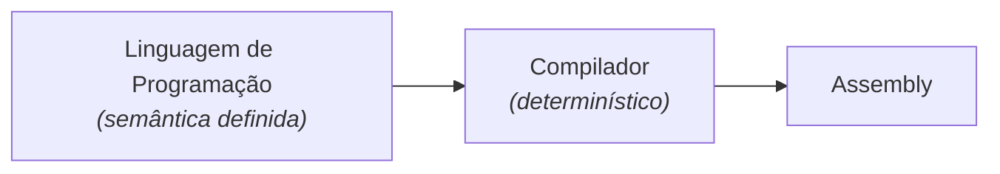
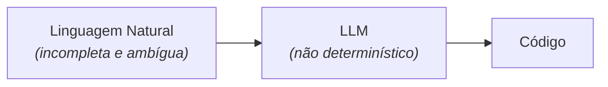
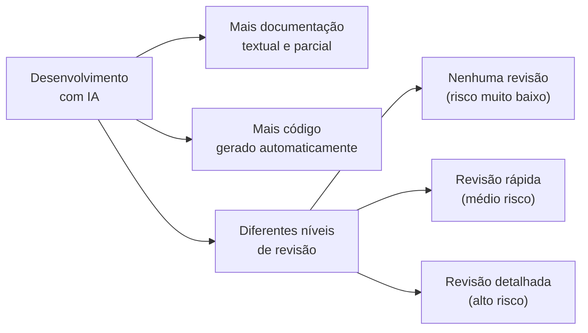

# Código Morreu?

Com o avanço dos modelos de linguagem e dos agentes de codificação,
tornou-se comum ouvir que **código morreu**. Consequentemente, não
precisaremos mais escrever ou ler código. É comum ouvir também que 
vai ocorrer com código o mesmo que aconteceu com assembly. 

Mas essa comparação não é boa, na nossa visão. 

Claro, não programamos
mais em assembly. Mas isso aconteceu porque assembly foi substituído
por linguagens de programação que sempre tiveram uma semântica
bem definida. Essa característica permitiu o desenvolvimento de
compiladores que traduzem deterministicamente programas escritos nessas
linguagens para o nível mais baixo, conforme ilustrado a seguir.

Porém, essa capacidade de tradução entre níveis de abstração é perdida
quando se usa modelos de IA no desenvolvimento de software. 

No caso de
LLMs, o nível mais alto são os prompts, escritos em linguagem natural
(isto é, português, inglês, etc).
E historicamente sabemos que linguagem natural é uma notação verbosa,
incompleta e ambígua para especificar software. Para complicar, LLMs
são ferramentas não-determinísticas, ou seja, sujeitas a erros de
tradução, os quais não acontecem com compiladores, conforme figura
abaixo:

Por isso, se quisermos decretar a morte de código, precisamos antes
eleger um substituto, assim como ocorreu com assembly. E, conforme
afirmamos, esse substituto, pelo menos de uma forma mais geral, não
serão apenas textos em linguagem natural.

Se a gente concordar que será difícil eleger um substituto universal para
código, é razoável imaginar uma realidade de desenvolvimento de
software fragmentada, conforme ilustrado a seguir. Provavelmente,
teremos mais documentação textual, mas sempre parcial. E muito mais código 
gerado por LLMs, obviamente. E, por fim, teremos níveis de revisão de código, 
desde nenhuma revisão (para código menos crítico) até uma revisão 
humana e detalhada, para as partes mais sensíveis e com mais risco.

 
Portanto, talvez seja melhor dizer que **código ficou mais barato** e
fácil de ser gerado. Mas, em um número ainda importante de cenários e
funcionalidades, esse código ainda deverá ser revisado, entendido e 
refatorado, antes de entrar em produção.

Consequentemente, uma nova responsabilidade de engenheiros de software será
tomar decisões sobre o que vale a pena documentar e 
sobre o nível de revisão necessário em cada parte de um sistema.
