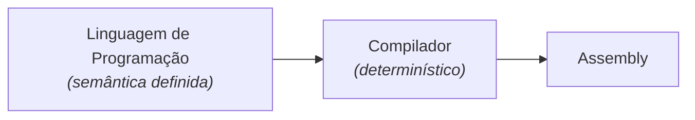
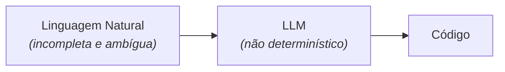
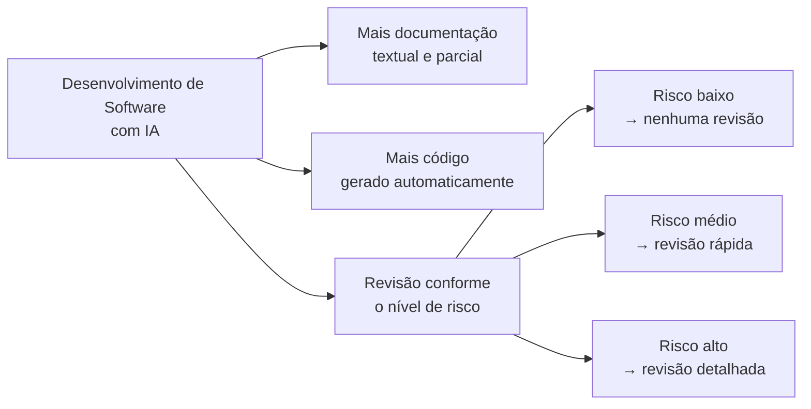

# Código Morreu?

Com o avanço dos modelos de linguagem e dos agentes de codificação,
tornou-se comum ouvir que **código morreu**. Consequentemente, não
precisaremos mais escrever ou ler código. É comum ouvir também que 
vai ocorrer com código o mesmo que aconteceu com assembly. 

Mas essa comparação não é boa, na nossa visão. 

Claro, não programamos mais em assembly. Mas isso somente aconteceu
porque assembly foi substituído por linguagens de programação que
sempre tiveram uma semântica bem definida. Essa característica permitiu
o desenvolvimento de compiladores que traduzem deterministicamente
programas escritos nessas linguagens para o nível mais baixo, conforme
ilustrado a seguir.

Porém, essa capacidade de tradução entre níveis de abstração é perdida
quando usamos modelos de IA no desenvolvimento de software. 

No caso de LLMs, o nível mais alto são os prompts, escritos em linguagem
natural (isto é, português, inglês, etc.). E historicamente sabemos que
linguagem natural é uma notação verbosa, incompleta e ambígua para
especificar software. Para complicar, como ilustrado a seguir, LLMs são
ferramentas não-determinísticas, ou seja, sujeitas a erros de tradução, 
os quais não acontecem com compiladores.

Por isso, se quisermos decretar a morte de código, precisamos antes
eleger um substituto, assim como ocorreu com assembly. E, conforme
afirmamos, esse substituto, pelo menos de uma forma mais geral, não
devem ser apenas prompts e outros documentos em linguagem natural.

Se concordarmos então que será difícil eleger um substituto universal
para código, é razoável imaginar que estamos migrando para uma
realidade de desenvolvimento de software fragmentada, conforme também
ilustrado a seguir. Teremos mais documentação textual, mas sempre ainda
parcial. E muito mais código gerado por LLMs, obviamente. E, não menos
importante, teremos níveis de revisão de código, desde nenhuma revisão
(para código menos crítico) até uma revisão humana e detalhada, para as
partes mais sensíveis e com mais risco.

Portanto, talvez seja mais adequado dizer que **código ficou mais
barato** de ser gerado. Mas, em um número relevante de cenários
e funcionalidades, ele ainda terá que ser revisado, entendido e
largamente refatorado, antes de entrar em produção.

Consequentemente, uma nova responsabilidade de engenheiros de software
será decidir sobre o que vale a pena documentar e sobre o nível
de revisão necessário em cada parte de um sistema.

## Manutenção de Código Gerado por IA

Uma outra consideração importante, após a geração e revisão, é sobre a
manutenção do código gerado por IA. Sabemos que no caso de software,
mudanças constituem a regra, o que torna a fase de manutenção e
evolução mais importante do que a fase de geração inicial.

Porém, no caso de manutenção de um código gerado por IA (e que não foi
revisado por humanos), as dúvidas são ainda 
maiores: vamos conseguir manter esse código também por IA? Por exemplo,
vamos conseguir delegar a correção de bugs, refatorações,
atualizações de dependências, etc? 

Porém, uma resposta mais segura para essa pergunta ainda deve 
demorar alguns anos, que é o período necessário para os
sistemas gerados por IA passarem por um número importante de
manutenções.

